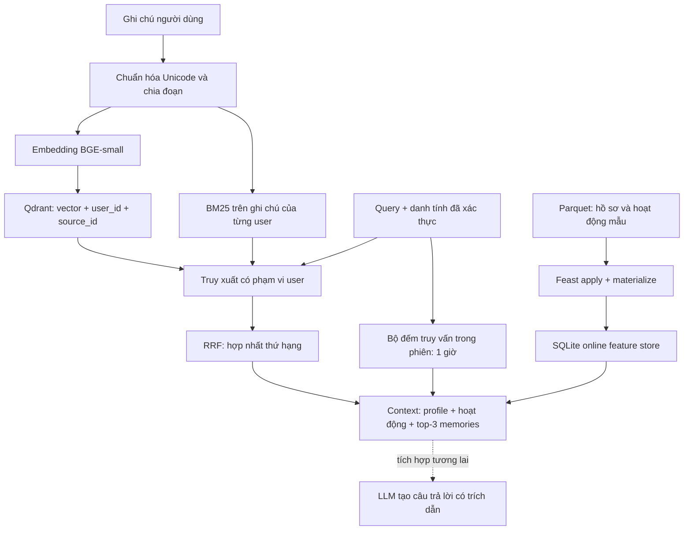

# Trợ lý ghi nhớ cho sinh viên cybersecurity

POC này hỗ trợ lưu ghi chú học tập và truy xuất chúng cùng hồ sơ người dùng.
Code và tài liệu được xây dựng với hỗ trợ của Codex; người học cần đọc lại,
thử các truy vấn riêng và chịu trách nhiệm giải thích các quyết định dưới đây.
Dữ liệu demo là dữ liệu tổng hợp, không chứa thông tin hệ thống pentest thật.

Trong bản đang chạy, `recall()` trả context, chưa gọi LLM. Mũi tên nét đứt
thể hiện phần tích hợp đề xuất, không phải chức năng đã hoàn thành. Feast
được materialize ở NB4 trước khi chạy demo. Truy xuất cả vector lẫn keyword
chỉ nhìn vào ghi chú của user yêu cầu. Hồ sơ định hướng cách trả lời và
ngôn ngữ, không được sử dụng như cơ chế cấp quyền truy cập.

## 1. Chia đoạn: giới hạn theo từ và giữ nguồn

Tôi chọn đoạn tối đa 120 từ, chồng lấn 20 từ, lưu `source_id` và vị trí đoạn.
Ghi chú ngắn thường trở thành một đoạn. So với lưu nguyên cuộc hội thoại,
đoạn ngắn giảm lượng nội dung không liên quan trong context và giúp câu hỏi
về JWT không kéo theo toàn bộ buổi học Kubernetes. Đổi lại, nhiều đoạn làm
tăng số vector và chi phí lưu trữ; phần overlap tạo một lượng nội dung trùng.
So với chia từng câu, kích thước này giữ được bước thực hiện cùng lý do và
điều kiện áp dụng, vốn quan trọng trong ghi chú security.

120 từ không đồng nghĩa 120 token. Đây là giới hạn đơn giản cho POC và không
bảo đảm tránh cắt ngắn đầu vào của mọi model. Tài liệu dài cần chunker theo
tokenizer thực tế, giữ heading, bảng và code block. Tách đoạn theo ngữ nghĩa
có thể tốt hơn nhưng cần thêm model hoặc quy tắc và tăng độ phức tạp. Tôi
chưa chọn cách đó vì bài demo chỉ lưu ghi chú ngắn, cần dễ đọc và kiểm chứng.
Một hạn chế khác là overlap có thể đưa hai đoạn của cùng nguồn vào top-3;
bản nâng cấp nên gộp theo nguồn trước khi lắp context.

## 2. Schema hồ sơ: tabular và có ngữ nghĩa rõ

Tôi sử dụng các feature view có sẵn trong NB4: `user_profile_features`
với entity `user_id`, nguồn Parquet, TTL 30 ngày; gồm ngôn ngữ, tốc độ đọc
và chủ đề quan tâm. `query_velocity_features` cũng theo `user_id`, TTL
1 giờ, chứa số truy vấn gần đây. Registry mô tả schema, SQLite phục vụ
online lookup, còn historical lookup phải dùng point-in-time join.

Tabular feature dễ giải thích: người dùng có thể hiểu và sửa `vi`, `en`
hoặc `security`. So với một embedding sở thích ẩn, nó ít chiều hơn, dễ
kiểm tra và không cần huấn luyện mô hình personalization. Đổi lại, một
`topic_affinity` duy nhất không biểu diễn được đồng thời pentest, SOC và
AI. POC đọc hồ sơ để đưa vào context, không hard-filter memory theo topic,
vì NB6 cho thấy filter suy đoán có thể loại bằng chứng đúng.

TTL của Feast không phải lời hứa rằng dữ liệu đã được cập nhật liên tục.
Đặc biệt, TTL dùng trong historical retrieval không thay thế việc kiểm tra
độ mới tại serving. Nguồn NB4 là snapshot tổng hợp, nên demo ghi rõ nguồn
hồ sơ và phân biệt nó với `session_queries_last_hour`, được đếm từ các lần
gọi thật trong phiên. Nếu registry hoặc dữ liệu không tồn tại, demo phải
báo thiếu prerequisite thay vì giả lập một kết quả Feast thành công.

## 3. Độ mới: chọn theo loại thông tin

Ghi chú vừa lưu phải đọc lại được ngay sau khi `remember()` hoàn tất; upsert
đợi hoàn thành với `wait=True`. Đổi lại, người dùng phải chờ embedding tại
bước ghi, và ghi chú chỉ tồn tại trong RAM ở bản này. Đây là lựa chọn phù
hợp cho POC ít người dùng, chưa phải SLA production.

Hoạt động trong phiên cập nhật mỗi lần recall, bỏ timestamp quá một giờ.
Nó phản ánh tức thì việc người dùng vừa hỏi gì về mặt số lượng, nhưng
không phải streaming feature pipeline và không suy luận chủ đề gần đây.
Trong sản phẩm thật, tín hiệu phát hiện bất thường cần event stream và
Feast Push API hoặc pipeline tương đương, xử lý trùng sự kiện, sự kiện đến
muộn và timestamp. Batch mỗi 5 phút rẻ hơn nhưng bỏ lỡ burst ngắn.

Hồ sơ ổn định có thể refresh hàng ngày, hoặc ngay khi người dùng đổi
ngôn ngữ. Refresh hàng giây cho tốc độ đọc thường không đáng chi phí.
Ba trường hợp vì vậy có độ mới khác nhau: ghi chú mới tức thì, tín hiệu
hoạt động tức thì trong POC, hồ sơ theo batch. Mỗi trường hợp phải có
timestamp và tiêu chí freshness riêng; không dùng một TTL cho tất cả.

## 4. Truy xuất, tiếng Việt và phương án bị loại

RRF dùng hạng bắt đầu từ 1 và hằng số 60. BM25 giữ tín hiệu tên kỹ thuật,
embedding hỗ trợ diễn đạt lại. Regex token giữ định danh dạng CVE-2024-1234
và T1059, chuẩn hóa Unicode NFC nhưng không bỏ dấu tiếng Việt. Cách này
hỗ trợ code-switching như “kiểm tra JWT issuer”, song chưa tách từ tiếng
Việt và chưa sửa lỗi gõ. BGE-small thiên về tiếng Anh được giữ để chạy
nhanh trên CPU; không có cam kết rằng paraphrase tiếng Việt sẽ tốt. Nâng
cấp multilingual cần benchmark, tính chi phí và index lại toàn bộ memory.

Tôi loại phương án lưu toàn bộ ghi chú vào Feature Store. Feature Store
phù hợp lookup có schema theo entity và thời điểm, còn ghi chú có độ dài
thay đổi cần tìm kiếm ngữ nghĩa và trích nguồn. Gộp hai phần làm chu kỳ
materialization phụ thuộc việc thêm từng đoạn và làm retrieval khó hiểu.
Tôi cũng loại cách lấy top-K toàn hệ thống rồi mới lọc user: NB5 cho thấy
recall suy giảm, còn NB7 minh họa hậu quả rò dữ liệu giữa tenant.

## 5. Giới hạn và kiểm chứng

`user_id` trong POC do người gọi cung cấp; production phải lấy nó từ danh
tính đã xác thực, không tin query parameter. Filter metadata là một phần
kiểm soát truy xuất, không thay thế authorization. BM25 cũng phải cùng
phạm vi user, vì chỉ lọc vector vẫn để keyword rò dữ liệu. Demo lưu một
ghi chú của user khác và kiểm tra nó không có trong năm context; test bổ
sung kiểm tra cả hai danh sách thứ hạng.

Context đánh dấu memory là dữ liệu chưa đáng tin. Nhãn này giúp trình bày
ranh giới nhưng không chứng minh chống prompt injection nếu nối với LLM.
POC chưa có xác thực, lưu bền, mã hóa, xóa memory, đồng bộ thiết bị, audit
log hoặc giới hạn tài nguyên. Nó không chạy lệnh hay công cụ pentest. Khi
cần train mô hình từ history, phải tách train/test và PIT join trước khi
đánh giá, như NB8; dữ liệu tương lai không được vào feature của sự kiện cũ.
